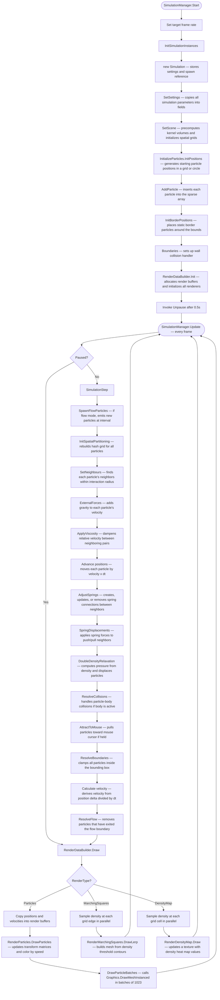

```mermaid
flowchart TD
    A([SimulationManager.Start]) --> B[Set target frame rate]
    B --> C[InitSimulationInstances]

    C --> D[new Simulation — stores settings and spawn reference]
    D --> E[SetSettings — copies all simulation parameters into fields]
    E --> F[SetScene — precomputes kernel volumes and initializes spatial grids]
    F --> G[InitializeParticles.InitPositions — generates starting particle positions in a grid or circle]
    G --> H[AddParticle — inserts each particle into the sparse array]
    H --> I[InitBorderPositions — places static border particles around the bounds]
    I --> J[Boundaries — sets up wall collision handler]
    J --> K[RenderDataBuilder.Init — allocates render buffers and initializes all renderers]
    K --> L[Invoke Unpause after 0.5s]

    L --> M

    M([SimulationManager.Update — every frame]) --> N{Paused?}
    N -- No --> O[SimulationStep]
    N -- Yes --> R

    O --> O1[SpawnFlowParticles — if flow mode, emits new particles at interval]
    O1 --> O2[InitSpatialPartitioning — rebuilds hash grid for all particles]
    O2 --> O3[SetNeighbours — finds each particle's neighbors within interaction radius]
    O3 --> O4[ExternalForces — adds gravity to each particle's velocity]
    O4 --> O5[ApplyViscosity — dampens relative velocity between neighboring pairs]
    O5 --> O6[Advance positions — moves each particle by velocity x dt]
    O6 --> O7[AdjustSprings — creates, updates, or removes spring connections between neighbors]
    O7 --> O8[SpringDisplacements — applies spring forces to push/pull neighbors]
    O8 --> O9[DoubleDensityRelaxation — computes pressure from density and displaces particles]
    O9 --> O10[ResolveCollisions — handles particle-body collisions if body is active]
    O10 --> O11[AttractToMouse — pulls particles toward mouse cursor if held]
    O11 --> O12[ResolveBoundaries — clamps all particles inside the bounding box]
    O12 --> O13[Calculate velocity — derives velocity from position delta divided by dt]
    O13 --> O14[ResolveFlow — removes particles that have exited the flow boundary]
    O14 --> R

    R[RenderDataBuilder.Draw] --> S{RenderType?}

    S -- Particles --> T[Copy positions and velocities into render buffers]
    T --> T2[RenderParticles.DrawParticles — updates transform matrices and color by speed]
    T2 --> T3[DrawParticleBatches — calls Graphics.DrawMeshInstanced in batches of 1023]

    S -- MarchingSquares --> U[Sample density at each grid edge in parallel]
    U --> U2[RenderMarchingSquares.DrawLerp — builds mesh from density threshold contours]

    S -- DensityMap --> V[Sample density at each grid cell in parallel]
    V --> V2[RenderDensityMap.Draw — updates a texture with density heat map values]

    T3 --> M
    U2 --> M
    V2 --> M
```
